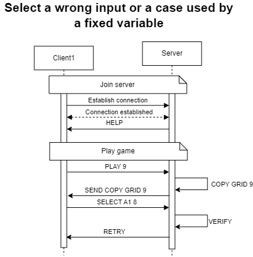

# Sudoku Game Protocol

The Sudoku Game Protocol defines the communication between a client and a server for a Sudoku game application. The server contains the original grid, send it to the user, it also verifies the user's moves, and handles multiple clients playing different games concurrently.

## Section 1 - Overview

The Sudoku Game Protocol allows users to connect to a server, request Sudoku grid, and submit moves. The server verifies the correctness of each move and provides feedback.

## Section 2 - Transport Protocol

The Sudoku Game Protocol uses TCP to ensure reliable data transmission. The server listens on port **1236** for client connections.

### Protocol Details
- **Transport protocol**: TCP (Transmission Control Protocol)
- **Port**: 1236
- **Encoding**: UTF-8
- **Message delimiter**: Newline character (`\n`)

## Section 3 - Connection and Game Setup

1. **Connection Initialization**:  
   The client initiates a connection to the server. The server sends every commands to play the game.

2. **Game Start**:  
   The client start a new game, specifying the size of the grid from the server.
3. **Make a move**
   The client select a case and a number to play. The server verify the rightness of the move, and sends feedback.
4. **End of the game**
   The client select the last case with the good number. The server sends a feedback and send again the commands to play the game.

## Section 4 - Messages

### Establish connection
Server sends HELP: 
'Welcome to the Sudoku game, here are the commands to start:
- PLAY <size of grid> (9/16)
- SELECT <case name> <number to play>

You can anytime send HELP to see it again!'
### Start the game
```bash 
PLAY <size of grid>
```
- size of grid: choose the size of the sudoku grid (9/16)
#### Response
- ERROR : An error occurred during the start of the game. The size of the grid must be 9 or 16. The error codes are as follow:
  - 1: The size of the grid does not exist

### Make a move
```bash
SELECT <case name> <number to play>
```
- case name : Select the name of the case, for example, with a grid 9: case name are from 'A1' to 'I9'.
- number to play: Select the number you want to introduce to the case name.
#### Response
- RETRY : The case name corresponds to nothing. Choose a case name valid that exists on the grid.
- 1: The case name is not valid
- RETRY : Wrong answer, retry.
  - 1: The number must be between 1 and size of grid
  - 2: The response is not valid
  
### End of game 
Server sends COMPLETED:
Congratulation, you won!
then it sends HELP again.

## Section 5 - Examples

### Working example


### ERROR: Select a game size that does not exits


### ERROR : Select a wrong input or a case used by a fixed variable



