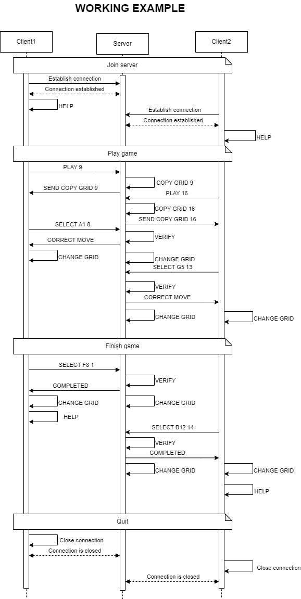

# Sudoku Game Protocol

The Sudoku Game Protocol defines the communication between a client and a server for a Sudoku game application. The server contains the original grid, send it to the user, it also verifies the user's moves, and handles multiple clients playing different games concurrently.

## Section 1 - Overview

The Sudoku Game Protocol allows users to connect to a server, request Sudoku grid, and submit moves. The server verifies the correctness of each move and provides feedback.

|    | 1 | 2 | 3 | 4 | 5 | 6 | 7 | 8 | 9 |
---|-|--|-|-|-|--|-|-|-|
 A |  |  | |  |   |  |   |   |   |
| B |  |  | |  |   |  |   |   |   |
| C |  |  | |  |   |  |   |   |   |
| D |  |  | |  |   |  |   |   |   |
| E |  |  | |  |   |  |   |   |   |
| F |  |  | |  |   |  |   |   |   |
| G |  |  | |  |   |  |   |   |   |
| H |  |  | |  |   |  |   |   |   |
| I |  |  | |  |   |  |   |   |   |


## Section 2 - Transport Protocol

The Sudoku Game Protocol uses TCP to ensure reliable data transmission. The server listens on port **1236** for client connections.

### Protocol Details
- **Transport protocol**: TCP (Transmission Control Protocol)
- **Port**: 1236
- **Encoding**: UTF-8
- **Message delimiter**: Newline character (`\n`)

## Section 3 - Connection and Game Setup

1. **Connection Initialization**:  
   The client initiates a connection to the server. The server sends every commands to play the game.

2. **Game Start**:  
   The client start a new game, specifying the size of the grid from the server.
3. **Make a move**
   The client select a case and a number to play. The server verify the rightness of the move, and sends feedback.
4. **End of the game**
   The client select the last case with the good number. The server sends a feedback and send again the commands to play the game.

## Section 4 - Messages

### Establish connection
Server sends HELP: 
'Welcome to the Sudoku game, here are the commands to start:
- PLAY <size of grid> (9 or 16) 
- SELECT <case name> <number to play> (if the size of grid is 9: case name : A1-I9, if the size of grid is 16 : A1 - P16");
- QUIT
You can anytime send HELP to see it again!
### Start the game
```bash 
PLAY <size of grid>
```
- size of grid: choose the size of the sudoku grid (9 or 16)
#### Response
- OK : The game starts
- ERROR : An error occurred during the start of the game. The size of the grid must be 9 or 16. The error codes are as follow:
  - 1: The size of the grid does not exist
  - 2: You must enter a size parameter

### Make a move
```bash
SELECT <case name> <number to play>
```
- case name : Select the name of the case, for example, with a grid 9: case name are from 'A1' to 'I9'.
- number to play: Select the number you want to introduce to the case name.
#### Response
- CORRECT MOVE
- BAD MOVE : This number can't be here!
- ALREADY PLACED : This is a fixed variable, it can not be changed
- OUT OF BOUNDS : Select a case or a number that exists on the grid
  
### End of game 
Server sends COMPLETED:
Congratulation, you won!
then it sends HELP again.

## Section 5 - Examples

### Working example


### ERROR: Select a game size that does not exist


### ERROR: Select a case before start a game


### RETRY : Select a wrong input


### RETRY : Select a case with a fix variable


### RETRY : Select a number or a case out of bounds


